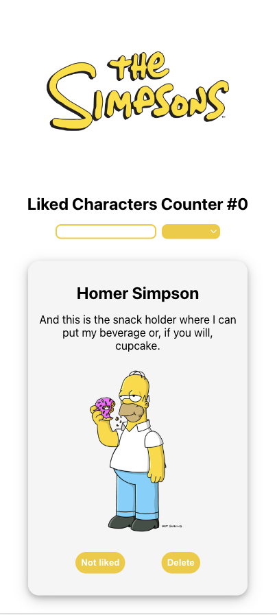

# Description
Introducing the "Simpsons Quote" web app, inspired by the Simpsons Quote API. 

This app allows users to immerse themselves in the world of The Simpsons through an array of interactive features.

The app features a collection of quotes cards organized by Simposons character, a search bar that filters the results by character. 
To further enhance the user experience, the user has the ability to like/unlike a character and delete the characters' quote cards he does not like. 

The app also includes a counter that showcases the number of liked characters.

# Live Preview
[Live Preview](https://64c0db04ff0b953f9e57e4e6--glowing-druid-27993b.netlify.app/).

# Technogies used :computer:
- [Create React App](https://github.com/facebook/create-react-app);
- [Redux](https://redux.js.org/);
- [Redux Toolkit](https://redux-toolkit.js.org/) template;
- CSS for styling;
- Canva for logos and colour palette;

## Available Scripts :open_file_folder:

In the project directory, you can run:

### `npm run dev`

Runs the app in the development mode.\
Open [http://localhost:3000](http://localhost:3000) to view it in your browser.

The page will reload when you make changes.\
You may also see any lint errors in the console.

